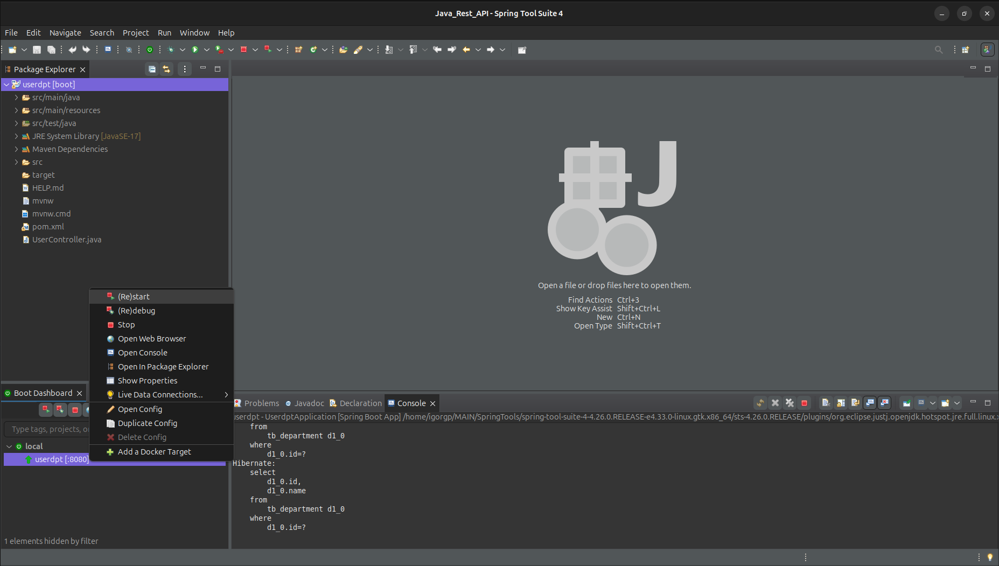
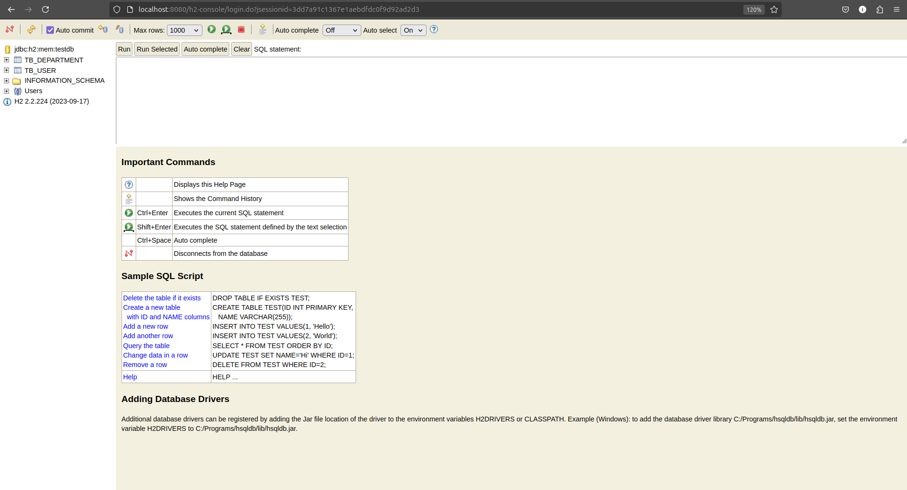

# REST API com Java e SpringBoot

#### Um sistema construído em Java e Spring Boot com banco de dados, gerenciamento do banco de dados, requisições web, criação de usuários e mais!

## Introdução
- **Contexto:**
	A API REST foi criada a partir de inspirações de outros projetos junto do meu atual conhecimento em relação ao desenvolvimento com Java e Spring Boot. Capaz de usar diferentes ferramentas e co-relacionar estas informações de um usuário com um departamento que o mesmo ocupa. 

- **Objetivo:**
	O projeto foi criado com a intenção de apresentar uma forma simples e eficaz de como trabalhar com o Java e o SpringBoot, ferramentas muito fortes e úteis.

- **Ferramentas:**
	Usando ferramentas como o [Spring Initializr](https://start.spring.io/), [Spring Tools Suite](https://spring.io/tools), [PostMan](https://www.postman.com/) dentre outros!

* **Principais recursos:** 
	Esta aplicação possui a capacidade de gerenciar e relacionar usuários inseridos no `PostMan` com o banco de dados web proporcionado pelo `Spring Boot` com o banco de dados `H2` a partir do `Maven`.

## Funcionalidades

- **Armazenagem Web**

	Capaz de criar um `localhost` próprio para a visualização do banco de dados, a instanciação de um entrada única faz com que seja facilmente a alteração de manipulação do usuário e senha que libera a visualização e gerenciamento do banco de dados. O uso de um caminho exclusivo e alternável também contribui para a segurança e fácil manipulação do código.

- **Adição de Usuário e manipulação**

	Graças ao uso do `PostMan` podemos facilitar a postagem de novos usuários diretamente dentro do banco de dados web. Usando o método `POST` ele faz a adição direta do usuário com base nos dados inseridos.

- **Formatação `JSON`**

	Os dados da tabela são formatados para o formato `JSON` para que uma estrutura bruta de dados seja convertida em uma estrutura legível e coerente, facilitando a adição de usuários a partir do `PostMan`. 

- **Entre Outros!**

	O projeto possui diversas aplicações, diferentes uso e diversos jeitos de manipulação. Seu fácil compreendimento o torna simples de alterar ao seus gostos e interesses. Modular, compreensivo e prático define bem as capacidades do projeto. 

## Primeiros passos

### Pré-requisitos:

#### Base Inicial
- **É fundamental que o usuário tenha conhecimentos em:**
	- Lógica de programação;
	- Programação Orientada a Objetos;
	- Java;
	- Spring Boot;
	- JSON;
	- Banco de Dados SQL;

#### Ferramentas que vão ser usadas
- **Manipulação do Código e Banco de Dados:**
	- Usar o [Spring Tools Suite](https://spring.io/tools) é fortemente recomendado, pois ele foi feito para facilitar o uso do `Spring Boot` e projetos web como esse.
	 - [PostMan](https://www.postman.com/) para a manipulação dos arquivos `JSON` e permitindo assim a adição e remoção de usuários diretamente do banco de dados e descartando a necessidade de adicionar os mesmo diretamente no código.
	 - Um navegador de sua preferência.

#### Conhecendo o projeto
* **Clonando o Repositório:** 
	Para clonar o repositório use:
		Entre (pelo terminal) na pasta em que deseja que o projeto seja clonado e (ainda no terminal) rode o seguinte comando:
	~~~Bash
	git clone https://github.com/igorgp06/UserDpt_RestAPI.git
	~~~

* **Abrindo o Projeto:**
	- Abrir o projeto você deve abrir ele com o [Spring Tools Suite](https://spring.io/tools). Após isso, abra o arquivo `userdpt`. Caso tudo tenha dado certo você deverá ter o resultado igual (ou parecido) a este:

  
  

- **Rodando o projeto:**
	- Para rodar o projeto você deve clicar com o botão esquerdo na opção `Local` que fica localizado no canto esquerda inferior. Após isto, aperte com o botão direito sobre `userdpt` e em `(Re)start`. Tome a imagem abaixo como exemplo:

- **Localizando o host:**
	- Após a inicialização do projeto, um host local será criado com o seguinte domínio: `http://localhost:8080`. Copie e cole isso no seu navegador, se você for redirecionado para um página de erro está dando tudo certo até agora.
	- Para acessar a login do banco de dados, após ter colocado o `localhost` acrescente `/h2-console`, tendo esse resultado final `localhost:8080/h2-console`. Mude as informações como indicado abaixo:
		- JDBC URL = "jdbc:h2:mem:testdb"
		- User Name = "sa"
	- Após estas alterações, se sua tela de login estiver com a de acordo como a de baix, aperte em `Connect`:

 - **Navegação dentro do banco de dados:**
	- O projeto funciona com um banco de dados chamado de dados [H2](https://www.h2database.com/html/main.html) sendo que esse banco de dados tem o formato `SQL`, portando os comandos para a navegação do banco de dados também são na linguagem `SQL`. Para navegar entre as tabelas apenas escolha o que deseja visualizar e aperte `Run` para visualizar o visualizar a tabela. Veja abaixo a tela principal após o login ser efetuado corretamente:

- **Tutorial completo:**
	- O tutorial completo vai estar disponível na pasta `src/main/resources/static/videos` e no [YouTube](https://www.youtube.com/) em até no máximo uma semana após o deploy do projeto.

## Estrutura do Projeto
* **Estrutura de diretórios:** 
	* O projeto tem vários diretórios. Os mais importantes são (o sinal de * pode ser interpretado como a palavro tudo):  
		| userdpt  
		|----- src/main/java/* ---> contém os arquivos principais  
		|----- src/main/resources/* ---> contém as configurações do projeto e banco de dados  
		| userdptJRE System Library/* ---> configurações da JRE e do Java  
		| userdpt/Maven Dependencies/* ---> dependências do projeto Maven  
		| userdpt/pom.xml ---> instruções de dependências e versões  
	
	Os outros arquivos e diretórios tem sim sua importância porém porém vamos dar prioridade aos principais.

## Dados das Estruturas Principais

O projeto possuí uma hierarquia quando falamos de componentes e sua organização. Sendo que a pasta `.../src/main/java/*` contém toda a parte lógica e código bruto, ou seja, toda a parte de código visível está ali, como as configurações de controles, entidades e repositórios.   
Enquanto o arquivo `.../src/main/resources/*` contém uma parte estrutural do projeto, aqui é onde podemos encontrar a lógica de inserção e objetos ao banco de dados além das propriedade do projeto.  
O arquivo `pom.xml` possuí as dependências do projeto, podemos imaginar ele como se fosse a planta do projeto, os `resources` são as estrutures enquanto o `java` faz a parte estática por assim dizer.

## Detalhes técnicos
* **Tecnologias utilizadas:**  
	- [Spring Initializr](https://start.spring.io/) para o kick start do projeto;
	- [Spring Tools Suite](https://spring.io/tools) para a manipulação do código;
	- [PostMan](https://www.postman.com/) para a visualizar o e inserir informações no banco de dados

* **Manipulação conforme necessidade:** 
	* O código por ser mais complexo exige certo nível de experiencia com as ferramentas citadas para que a manipulação e alteração do código seja executada da maneira correta.

* **Exemplos de linhas manipuláveis:**
	- Para inserir novos usuários diretamente pela IDE pode usar o exemplo abaixo no aquivo `.../src/main/resources/import.sql`
~~~SQL
INSERT INTO tb_department(name) VALUES ('Gestão');
INSERT INTO tb_department(name) VALUES ('Informática');

INSERT INTO tb_user(department_id, name, email) VALUES (1, 'Teste 1', 'teste1@gmail.com');
INSERT INTO tb_user(department_id, name, email) VALUES (2, 'Teste 2', 'teste2@gmail.com');
~~~

## Contribuindo
Contribuições são sempre bem-vindas! Sinta-se a vontade para relatar bugs, sugestões e melhorias no [issues]().  
Correção de bugs e novas funcionalidades também são sempre muito bem vindas, crie um `pull request` [aqui]() e ajude-me com suas melhorias e correções.
## Licença e Código de Conduta
O projeto [REST API com Java e SpringBoot]() está sujeito a licença [APACHE LICENSE 2.0](https://www.apache.org/licenses/LICENSE-2.0).  

Por favor, siga o `NOTICE`, `CODE OF CONDUCT` e leia a `LICENSE` desse projeto para evitar incomodações futuras.  

Leia nosso [CODE OF CONDUCT](https://github.com/igorgp06/Login-System/blob/master/CODE_OF_CONDUCT.md).  

## Contato  
Para esclarecer dúvidas, mandar sugestões ou até mesmo bater um papo comigo, mande um Email para contateme.igorgp@gmail.com!

### Desenvolver responsável

Igor Gonçalves Pinheiro ou [igorgp06](https://github.com/igorgp06)

# Redes Sociais

  
  
  
  
  

## Repository Status

  

   

   

   

   

   

